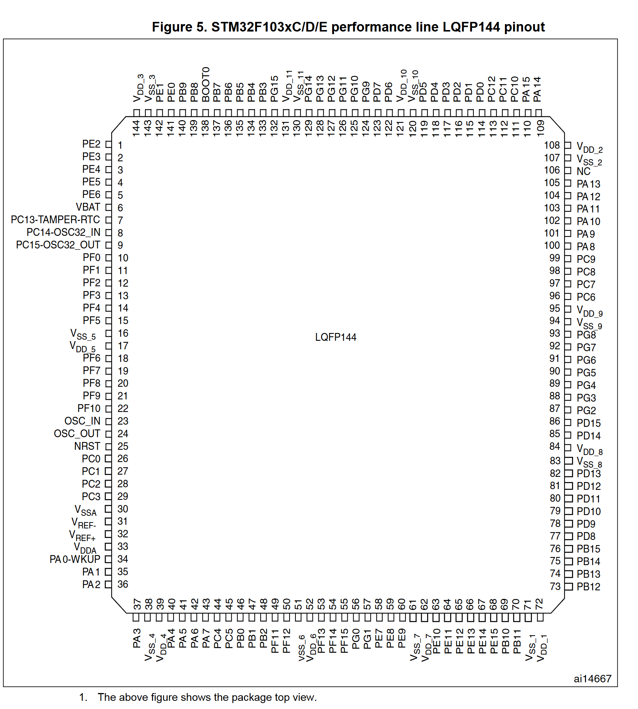
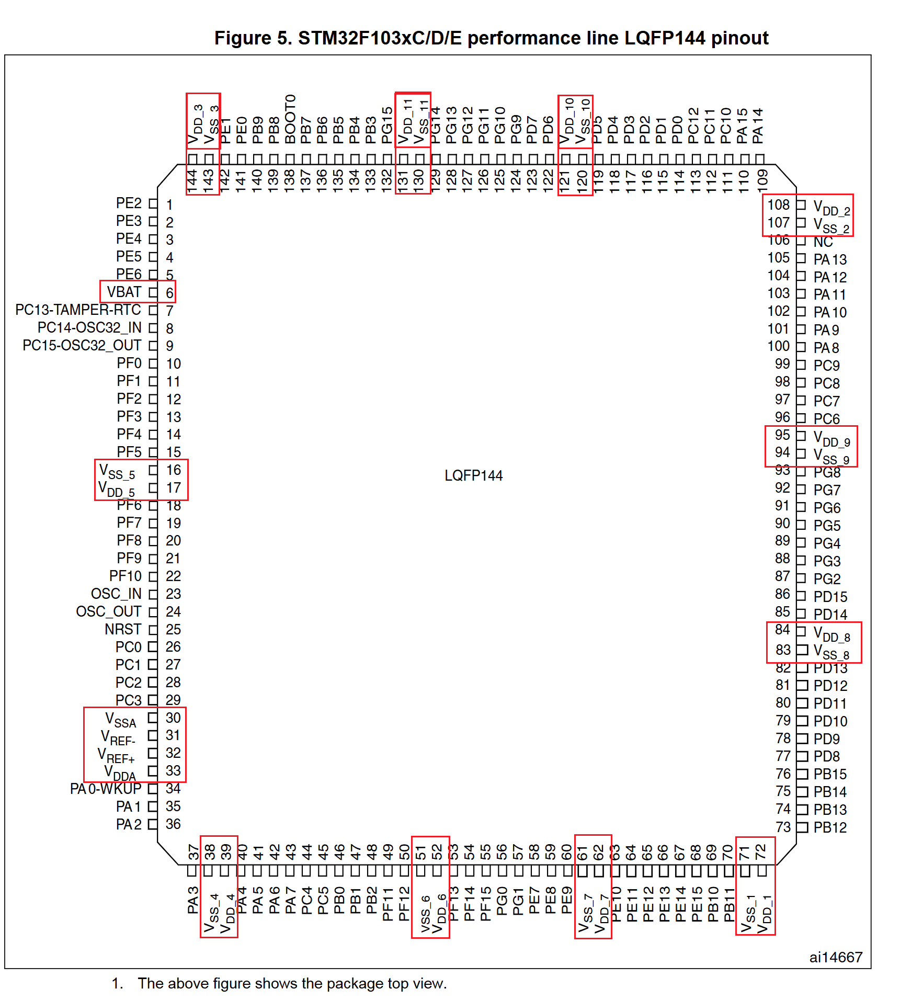
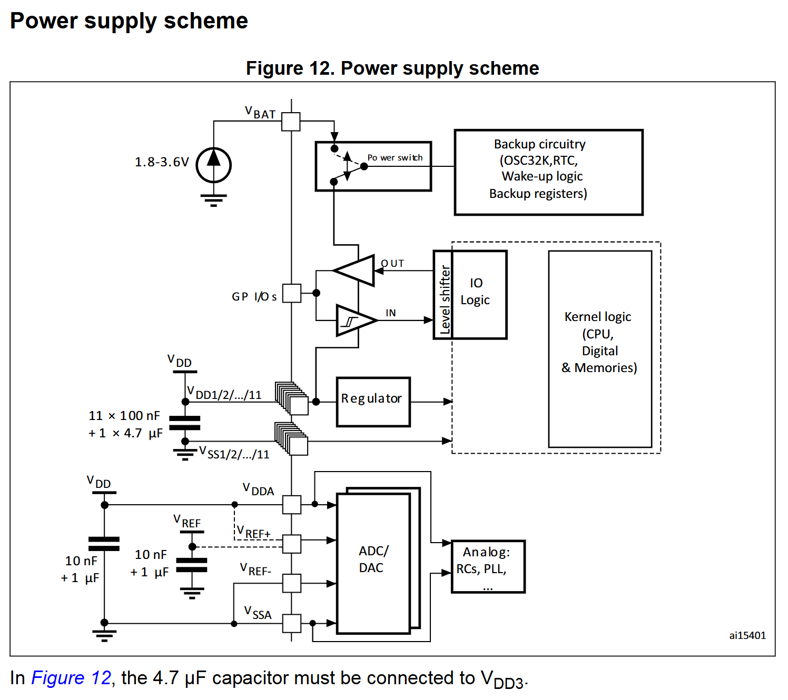

## stm32f10x 简介

以下以 stm32f103zet6 为例对 stm32f10x 系列的芯片进行介绍
STM32芯片引脚图参考(下图来自:[Datasheet - STM32F103xC, STM32F103xD, STM32F103xE](https://www.st.com/resource/en/datasheet/stm32f103ve.pdf))

## 电源管理

在pin脚图中，和电源相关如下图所示

以下对 VBAT、VDDA、VSSA、VDD_1 ~ VDD_11、VSS_1 ~ VSS_11 引脚进行介绍：

**1. VBAT**

**作用**：为实时时钟（RTC）和备份寄存器提供备用电源，当主电源 VDD 掉电后，通过 VBAT 脚可使 RTC 和备份寄存器继续工作，保留相关数据和时间信息，确保在系统断电情况下，时钟能正常走动以及备份的数据不丢失。

**连接方式**：通常外接一个电池，如可使用可充电的聚合物锂电池，需配置相应的充电电路；也可外接纽扣锂电池，通过限流电阻或其他保护电路接入 VBAT 引脚。

**2. VDDA 和 VSSA**

**作用**：为单片机内部的模拟器件，如 A/D 转换器、温度传感器、复位电路、内部高速RC振荡器、PLL 等提供电源。

**供电电压**：一般为 2.0V-3.6V，需使用稳定的电源，以确保模拟电路的正常工作和测量精度。

**3. VDD_1 ~ VDD_11 和 VSS_1 ~ VSS_11**

**作用**：为芯片内部不同的数字模块供电，如 I/O电路、待机电路提供工作电源，并通过电压调节器(Regulator)为CPU、存储器等核心器件提供1.8V的工作电源。

**供电电压**：一般为 2.0V-3.6V，通常采用 3.3V 供电。

**连接方式**：可以将 VDD_x 和 VSS_x 的引脚连接到同一个外部电源，也可分别接入不同的外部电源，若提供多个外部电源，可增加单片机的负载驱动能力，在多个 I/O 口需要驱动负载时，多路供电方式更加可靠。

**4. VREF+ 和 VREF-**

**作用**: VREF+ 是 ADC 和 DAC 的参考电压输入引脚，其电压值决定了 ADC 转换时的基准电压。VREF- 必须始终等于 VSSA，作为参考电压的负端。

**连接方式**:

 - 对于 64 引脚及以下的 STM32F103 芯片，内部的 VREF+ 与 VDDA 相连，VREF- 与 VSSA 相连，即 ADC 的参考电压默认为 VDDA 电压。
 - 对于 100 引脚以上的 STM32F103 芯片中，VREF+ 和 VREF- 会被引到片外，作为独立的引脚供用户使用

STM32的工作电压(VDD)为 **2.0 ~ 3.6V**，通过内置的电压调节器提供所需的1.8V电源，当主电源VDD 掉电后，通过VBAT 脚为实时时钟(RTC)和备份寄存器提供电源. (下图来自:[Datasheet - STM32F103xC, STM32F103xD, STM32F103xE](https://www.st.com/resource/en/datasheet/stm32f103ve.pdf) Page42)

## 参考

- [STM32电源框图解析＜VBAT、VDDA、VSSA、VDD、VSS等引脚＞](https://blog.csdn.net/weixin_48867130/article/details/142886329)

- [STM32单片机开发05：配置电源](https://mp.weixin.qq.com/s?__biz=MzU2MTAxNDQ1Mw==&mid=2247490373&idx=1&sn=264de52c633a9193fe227d0ebcafe0b0)

