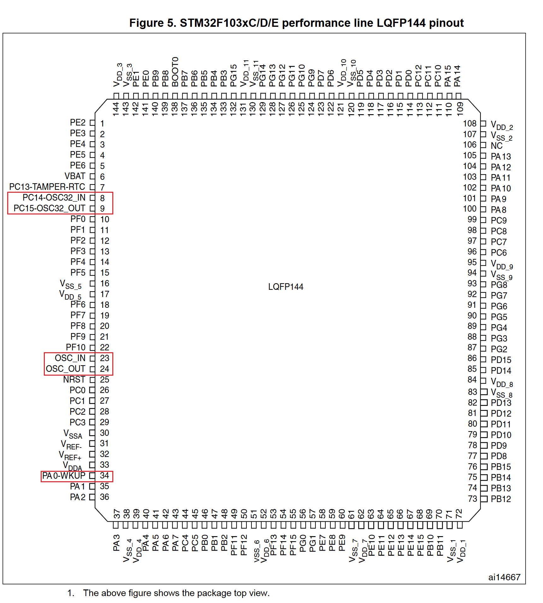
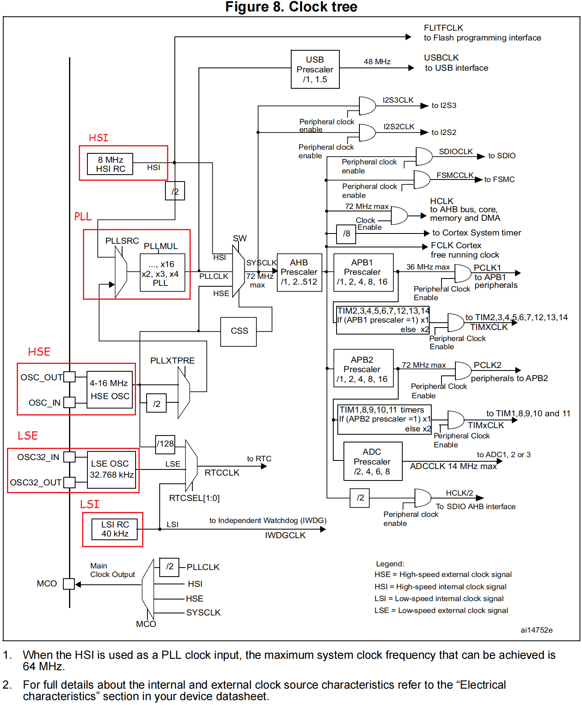

# stm32f10x 时钟管理

## 时钟相关引脚说明

和时钟相关的pin脚如下图所示

**OSC_IN 和 OSC_OUT**

**用途：**

用于连接外部高速晶体振荡器，为 STM32F10x 芯片提供主时钟信号。主时钟信号是 STM32F10x 内部各个模块和外设进行同步操作的基准时钟，通过连接外部晶体振荡器，可以获得更高的时钟精度和稳定性，适用于需要高精度时钟的应用场景。

**连接方式：**

OSC_IN 引脚接收外部晶体振荡器的时钟信号输入，OSC_OUT 引脚输出经过振荡器放大和整形后的时钟信号。这两个引脚一般需要连接到外部晶体振荡器的相应引脚上，以建立稳定的振荡回路。

!!! note "不使用外部晶振 OSC_IN 和 OSC_OUT 引脚处理"

    **1. 对于 100 脚或 144 脚的芯片**:

    OSC_IN 应接地，OSC_OUT 应悬空。

    **2. 对于少于 100 脚的芯片**：

    有两种接法：

    - **接法1: **OSC_IN和OSC_OUT分别通过10K电阻接地。此方法可提高EMC性能。

    - **接法2**: 分别重映射OSC_IN和OSC_OUT至PD0和PD1，再配置PD0和PD1为推挽输出并输出’0’。 此方法可以减小功耗并(相对上面2.1)节省2个外部电阻。

**OSC32_IN 和 OSC32_OUT**

**用途:**

用于连接外部 `32.768kHz` 低速晶体振荡器，为STM32F10x芯片提供低功耗时钟信号。该时钟信号主要用于实时时钟（RTC）和低功耗模式下的时钟源，适用于需要长时间运行、低功耗和精确时间计量的应用场景。

**连接方式:**

OSC32_IN 引脚接收外部 `32.768kHz` 晶体振荡器的时钟信号输入，
OSC32_OUT 引脚输出经过振荡器放大和整形后的时钟信号。
这两个引脚一般需要连接到外部 32.768kHz 晶体振荡器的相应引脚上，以建立稳定的振荡回路。

!!! note "不使用外部低速晶振时的处理"

    OSC32_IN 和 OSC32_OUT通常可以配置为普通 GPIO 引脚使用，或者悬空

## 时钟类型

- 外部高速时钟(HSE)：外接 `4 ~ 16MHz` 的外部晶体振荡器，连接引脚 OSC_IN 和 OSC_OUT

- 片内高速时钟(HSI)：内嵌出厂8MHz的RC振荡器(ARM内核使用)

- 外部低速时钟(LSE)：外接 `32.768KHz` 晶振（RTC时钟（实时时钟）使用，温漂小），连接引脚 PC14-OSC32_IN 和 PC15-OSC32_OUT

- 片内低速时钟(LSI)：内嵌带校准的40KHz的RC振荡器（RTC时钟（实时时钟）使用，温漂大）

| 名称 | 缩写 | 频率 | 连接方式 | 用途 | 特性 |
|:---:|:---:|:---:|---|---|---|
|外部高速晶体振荡器| HSE | 4~16MHz | OSC_IN 和 OSC_OUT | 系统时钟/RTC | 成本高，温漂小|
|内部高速RC振荡器| HSI | 8MHz | NA | 系统时钟 | 成本低，温漂大|
|外部低速晶体振荡器| LSE | 32kHz | OSC32_IN 和 OSC32_OUT | RTC | 成本高，温漂小|
|内部低速RC振荡器| LSI | 40kHz | NA | RTC | 成本低，温漂大|

STM32F10x中的时钟树(图片来自：[STM32F101xx, STM32F102xx, STM32F103xx, STM32F105xx and STM32F107xx advanced Arm®-based 32-bit MCUs](https://www.st.com/resource/en/reference_manual/rm0008-stm32f101xx-stm32f102xx-stm32f103xx-stm32f105xx-and-stm32f107xx-advanced-armbased-32bit-mcus-stmicroelectronics.pdf)如下图所示

## 参考

- [STM32芯片OSC_IN和OSC_OUT的作用和各种接法](https://blog.grabbyte.com/a/4cd2d78090f6009e01d020c4d293749c.html)

-